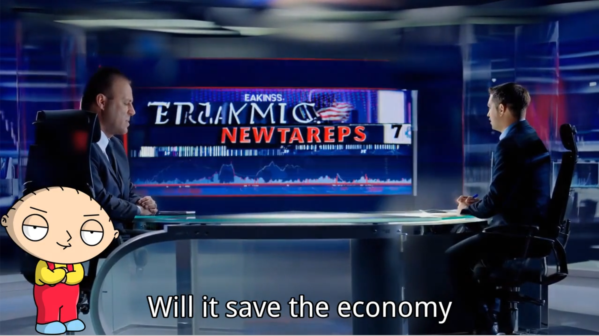

# 🎬 VideoGen — 从脚本到视频的AI自动化管道

> *"From words to worlds — VideoGen turns your ideas into living stories."*

**[English](README.md) | [中文版本](README_CN.md)**

VideoGen 是一个**AI驱动的视频生成引擎**，能够将文本脚本自动转换为完整的视频内容，包含匹配的视觉画面、TTS音频和字幕，适用于 YouTube、TikTok、Bilibili 等平台。

## 🤖 AI 模型

- **文本到视频模型**：Wan-AI/Wan2.1-T2V-14B-Turbo
- **音频模型**：GPT-SoVITS（微调）
- **LLM 模型**：DeepSeekV3

---

## ⚠️ 开发状态

**本项目目前正在积极开发中。** 代码库正在快速演进，部分功能可能不稳定或不完整。

如果您想使用 VideoGen 或为项目做出贡献，请直接联系作者以获取最新信息和访问权限。

---

## 🖼️ Web UI 预览


基于 Gradio 的 Web 界面提供了可视化方式来浏览、编辑和管理您的视频生成项目。

**使用方法：**
```bash
python run_browser.py
```
然后访问 `http://localhost:7860` 使用 Web 界面。

---

## 📺 示例视频

**示例视频（中文）：**

[](https://www.youtube.com/watch?v=RjH_D1CPzps)

**示例视频（英文）：**



---

## 📄 项目论文

我们已经撰写了一篇论文，详细描述了完整的管道、模型集成和设计原则。

[📄 阅读完整论文 (PDF)](example/paper/paper.pdf)

---

## ✨ 核心特性

### 🔊 文本转语音
使用 GPT-SoVITS 或微调的角色语音将脚本转换为语音。

**使用方法：** 在 `config/character_profiles.json` 中配置角色语音，系统将自动为每个脚本块使用指定的角色语音生成音频。

### 🎬 视觉匹配
LLM 生成的搜索词从 Pexels 获取相关视频片段。

**使用方法：** 系统自动分析脚本内容并生成搜索查询。当前已集成 SiliconFlow 视频生成 API 用于场景匹配。

### 📥 高清视频下载
自动获取最佳匹配的素材视频。

**使用方法：** 当使用 `text_video` 生成方法时，管道会自动处理。视频会被下载并存储在项目的 `video/` 目录中。

### 🧠 使用 LLM 进行场景匹配
脚本行转换为高质量的视频提示词。

**使用方法：** 决策系统自动为每个脚本块选择最佳生成方法。对于视觉内容，LLM 会生成详细的提示词，用于创建匹配的视频场景。

### 🎞️ 文本到视频生成
使用 Wan-AI/Wan2.1-T2V-14B-Turbo 等模型生成 AI 视觉内容。

**使用方法：** 当决策系统选择 `text_video` 方法时，系统会自动将提示词提交到视频生成 API 并管理异步生成过程。

### ✅ JSON + 媒体管道
支持块级别的音频/视频重新生成。

**使用方法：** 每个项目都存储为包含所有元数据的 JSON 文件。您可以手动编辑 JSON，通过将特定块的状态设置为 `"pending"` 并重新运行管道来重新生成它们。

### ⚙️ 基于 FastAPI 的控制
通过 RESTful 端点提供完整的程序化控制（即将推出）。

**使用方法：** FastAPI 服务器将提供用于项目管理、媒体生成和管道控制的端点。此功能目前正在开发中。

---

## 🛠️ 技术栈

- **LLM 模型**：DeepSeek-V3（通过 SiliconFlow API）
- **文本到视频模型**：Wan-AI/Wan2.1-T2V-14B-Turbo（通过 SiliconFlow API）
- **TTS 模型**：GPT-SoVITS / FunAudioLLM/CosyVoice2-0.5B（通过 SiliconFlow API）
- **动画引擎**：Remotion（React-based 视频生成）
- **视频处理**：FFmpeg
- **Web UI**：Gradio
- **Python**：3.9+

---

## ⚙️ 工作流程

### 1. 决策阶段（Decision）

LLM 分析每段脚本，自动选择最适合的生成方法：
- `text_video`：适合描述生动场景、动作或环境的文本
- `remotion_picture`：适合包含数字、统计、对比或结构化信息的文本
- `subtitle_only`：适合纯叙述性文本

### 2. 提示词生成（Prompt Generation）

对于需要视觉内容的块，LLM 生成详细的视频提示词。

### 3. 音频生成（Audio Generation）

使用 SiliconFlow TTS API 或 GPT-SoVITS 生成音频文件，支持：
- 多角色语音
- 自定义角色配置
- 情感调节

### 4. 视频生成（Video Generation）

根据决策结果：
- **text_video**：提交到 SiliconFlow 视频生成 API
- **remotion_picture**：使用 Remotion 渲染 React 动画
- **subtitle_only**：跳过视频生成

### 5. 视频拼接（Concatenation）

- 音视频混合（mux）
- 格式统一（normalize）
- 视频拼接（concat）
- 字幕生成和美化
- 字幕烧录（可选）

---

## 📂 项目配置

项目 JSON 文件结构：

```json
{
  "project": "my_project",
  "size": "landscape",  // 或 "tiktok"
  "script": [
    {
      "id": "L1",
      "text": "这是第一段脚本",
      "voice": "这是第一段脚本",
      "character": "narrator",
      "decision": "text_video",
      "status": "done",
      "video_generation": {
        "ok": true,
        "artifacts": ["video/L1.mp4"],
        "meta": {
          "video_path": "video/L1.mp4",
          "duration": 5.2
        }
      },
      "audio_generation": {
        "ok": true,
        "artifacts": ["audio/L1.wav"],
        "meta": {
          "audio_path": "audio/L1.wav",
          "total_duration": 5200
        }
      }
    }
  ]
}
```


## 💡 贡献

**本项目正在积极开发中。** 如果您想使用 VideoGen 或为项目做出贡献，请直接联系作者。

---


**Built with ❤️ by NP_123**

*Let's turn imagination into moving images.*
