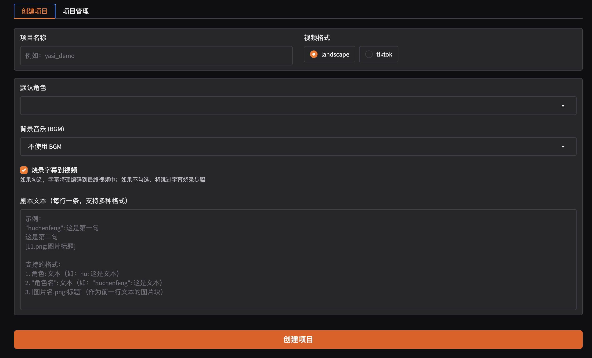

# 🎬 Video_Auto_Maker — 一键生成可发布短视频的全自动 AI 管道

> **给我一段文字，我给你一条成品短视频。**  

Video_Auto_Maker 是一个面向创作者、工程师与内容团队的 **端到端 AI 视频生成系统**。  
它能将一段纯文字脚本自动转换为完整短视频，包括：

- 场景画面（AI 文生视频 / 动态示意图）
- 多角色 TTS 配音（可情感控制）
- 字幕与节奏自动对齐
- 视频拼接与混音
- 横屏 / 竖屏适配（YouTube / TikTok）

**输入：纯文字**  
**输出：可直接上传平台的成片**
---

## 🎬 输入脚本 vs 自动生成的视频（成品展示）

|        🎞️ 视频类型        | 📄 视频内容简介                              |                   🎥 YouTube 预览（可点击）                   |
| :----------------------: | ------------------------------------------- | :----------------------------------------------------------: |
| 🇺🇸 科普类（英文 / 竖屏） | 介绍什么是大模型里的 Context Window         | <a href="https://youtube.com/shorts/Or9nb3m-yKA"></a> |
| 🇨🇳 故事类（中文 / 横屏） | 老高风格的 MH370 故事讲解视频               | <a href="https://youtu.be/MPJBOrTR8v0"></a> |
| 🇨🇳 观点类（中文 / 竖屏） | 户晨风风格重制：雅思八分含金量远超 211 本科 | <a href="https://youtube.com/shorts/dsHxtVA9J6Q"></a> |


---


## 🎬 输入脚本 vs 自动生成的视频（流程地展示）

**左边是纯文字脚本，右边是完全自动生成的视频。**

| 📄 纯文字脚本 | 🎥 自动生成的视频（本地播放） |
|--------------|-------------------------------|
| "dingzhen": 雷总，今天我写 PHP 发现了 Trait，xxx<br>"leijun": Trait 其实很正常，xxx<br>"dingzhen": 听着有点厉害，就是xxx<br>"leijun": 没错，它在xxx<br>[trait_expand.png: Trait 展开到类中的流程示意]<br>"dingzhen": 但是很多语言没有 Trait，xxx<br>"leijun": 不是的，xxx<br>"dingzhen": 哦，就是那些你到处都想用，xxx<br> | [](https://youtube.com/shorts/f7M_WSHvG8s) |

---


# 🚀 项目概述

Video_Auto_Maker 的目标非常明确：

> **从纯文字脚本 → 自动生成可直接上传短视频平台的成品视频**

整个管道覆盖 **写作以外的所有环节**，包括：

* 场景生成（文本 → 视频画面）
* 文本转语音（多角色、情感）
* 自动字幕
* 视频拼接与混音
* 格式标准化（16:9、9:16）
* pipeline 配置与状态管理

适合：

* 知识类讲解视频
* 讲故事类短视频
* 叙述型 vlog
* 纪录片式 narration
* AI 头像口播视频
* 内容农场式批量生产

---

# 🖼️ Web UI（Gradio 交互界面）



启动方法：

```bash
python videogen/gradio_app.py
```

所需的环境变量 `.env`可以从.env_example复制过来并且填充

---

# 🤖 核心使用的模型

* **文本到视频**：Wan-AI / Wan2.1-T2V-14B Turbo
* **TTS 配音**：GPT-SoVITS（支持角色微调）
* **LLM 生成决策、提示词、分镜**：DeepSeek-V3


---

# ❤️ 作者

**NP_123**
*Let's turn imagination into moving images.*

